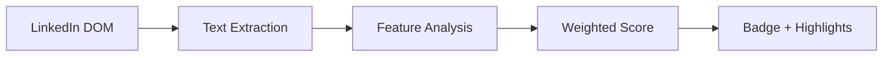
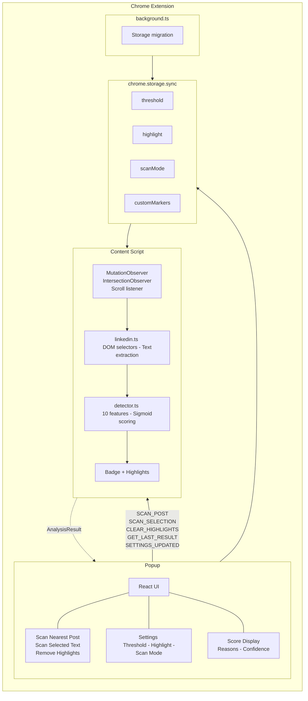
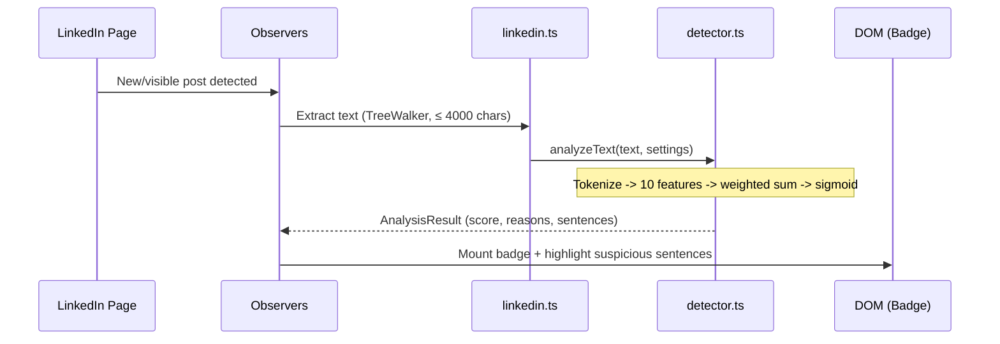
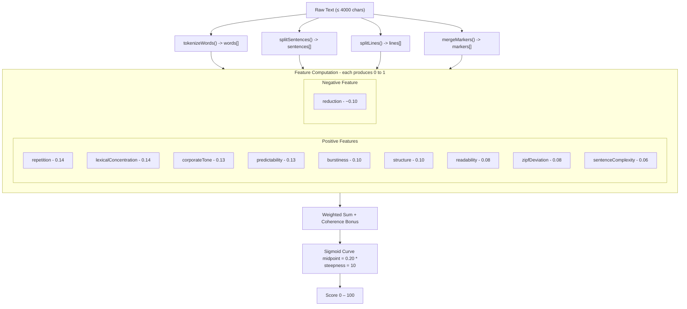

# HumanScore

Chrome extension that estimates how likely LinkedIn posts are to be AI-generated. It runs entirely in the browser using statistical heuristics - no network calls, no remote models, no data leaves your machine.

## How It Works

The extension scores each LinkedIn post from 0 to 100 based on 10 independent stylometric and structural features. Posts above a configurable threshold (default 65) are flagged with a badge and optionally have suspicious sentences highlighted.



## Architecture



### Data Flow



### Message Protocol

The popup and content script communicate via `chrome.runtime.onMessage`:

| Message Type | Direction | Purpose |
|---|---|---|
| `SCAN_POST` | Popup -> Content | Analyze the nearest visible post |
| `SCAN_SELECTION` | Popup -> Content | Analyze highlighted text selection |
| `CLEAR_HIGHLIGHTS` | Popup -> Content | Remove all inline highlights |
| `GET_LAST_RESULT` | Popup -> Content | Retrieve cached result for display |
| `SETTINGS_UPDATED` | Popup -> Content | Push new settings to content script |

## Detection Engine

### Feature Pipeline

Each post goes through `analyzeText()` which computes 10 features in parallel:



### Feature Descriptions

#### Positive Features (increase score)

**Repetition** (weight 0.14) - Detects repeated sentence starters, endings, n-gram reuse (bigrams through 4-grams), and structural emoji repetition (e.g. the same emoji used as bullet points across multiple lines). AI text tends to reuse phrase patterns and structural templates more than human writing.

**Lexical Concentration** (weight 0.14) - Measures vocabulary diversity using four metrics: Type-Token Ratio (TTR), Moving Average TTR (MATTR with window 25), hapax legomena ratio (words used only once), and Yule's K statistic. AI text typically has lower vocabulary diversity and more concentrated word reuse.

**Corporate Tone** (weight 0.13) - Counts matches against 177 built-in template phrases (e.g. "in today's fast-paced world", "the real takeaway", "here's why"), 22 transition markers ("furthermore", "consequently", "in addition"), and 79 AI-overused vocabulary words ("delve", "tapestry", "leverage", "holistic", "foster"). Normalized per word count to avoid penalizing long text.

**Predictability** (weight 0.13) - Computes Shannon entropy at multiple levels: word-level, bigram-level, sentence-starter, and sentence-ending. Also measures local coherence via Jaccard similarity between consecutive sentence word sets. AI text has lower entropy (more predictable word choices) and higher local coherence (unnaturally smooth transitions between sentences).

**Burstiness** (weight 0.10) - Measures uniformity of sentence length (coefficient of variation), word length distribution, and vocabulary rarity spread. Human writing has "bursty" variation - mixing short punchy sentences with long complex ones. AI tends toward uniform cadence. Also detects "medium word-length bias" where average word length falls in the 4.2–5.8 character range.

**Structure** (weight 0.10) - Detects numbered lists, bullet symmetry, "problem/solution/takeaway" triplets, repeated line prefixes, checklist patterns, emoji section headings, and the LinkedIn AI format (hook -> emoji-bulleted parallel sections -> conclusion). This feature captures the formulaic structure that AI-generated LinkedIn posts commonly follow.

**Readability** (weight 0.08) - Combines cadence uniformity, comma distribution uniformity, sentence-ending entropy, paragraph length uniformity, and Flesch-Kincaid grade level analysis. AI text tends to cluster in the grade 8–12 range with suspiciously low variance across sentences.

**Zipf's Law Deviation** (weight 0.08) - Fits a power-law curve to word frequency vs. rank using log-log linear regression, then measures three signals: flat alpha exponent (AI tends toward flatter distributions), unnaturally high R-squared (too perfect a Zipf fit), and uniform mid-range frequency distribution. Natural language follows Zipf's law with alpha near 1.0; AI text often deviates.

**Sentence Complexity** (weight 0.06) - Computes per-sentence complexity from subordinating conjunctions, relative pronouns, comma count, average word length, and sentence length. Measures the coefficient of variation of complexity scores across sentences. AI generates sentences with suspiciously uniform complexity; human writing varies naturally.

#### Negative Feature (decreases score)

**Humanizing Reduction** (weight -0.10) - Detects genuine human writing signals: expressive emoji (not structural/bullet emoji), slang and internet shorthand (lol, tbh, ngl, etc.), first-person references (I, my, me, we, our), numeric specifics (3+ digit numbers), technical tokens (C++, Node.js), exclamation marks, ellipsis, and extreme sentence length variety. These signals subtract from the score, reducing false positives on human text that happens to be well-structured.

### Scoring Calibration

The raw weighted sum (typically 0.05–0.50 for real text) is mapped through a sigmoid curve:

```
finalScore = 1 / (1 + e^(-10 × (rawScore - 0.20)))
```

This provides:
- Raw 0.05 -> Score ~18 (clearly human)
- Raw 0.15 -> Score ~38 (mostly human, some template)
- Raw 0.20 -> Score ~50 (ambiguous)
- Raw 0.30 -> Score ~73 (likely AI)
- Raw 0.40 -> Score ~88 (very likely AI)

Posts under 90 words receive a provisional score capped at 59 with a warning.

### Confidence Calculation

Confidence (0–100%) is derived from three factors:
- **Length factor** (45%): More text means more reliable analysis (scales from 90 to 500 words).
- **Feature agreement** (30%): Low standard deviation across feature values means signals agree.
- **Feature breadth** (25%): More active features (value > 0.15) means broader evidence.

### Sentence-Level Scoring

Individual sentences are scored for highlighting based on: repeated starters, template marker matches, AI vocabulary density, transition marker matches, list formatting, word-length smoothness relative to the global average, and sentence length falling in the AI-typical 10–24 word range.

## Project Structure

```
HumanScore/
├── public/
│   ├── manifest.json          # Chrome extension manifest (MV3)
│   ├── popup.html             # Popup shell
│   ├── popup.css              # Popup styles
│   └── content.css            # Injected page styles (badges, highlights)
├── src/
│   ├── background.ts          # Service worker: storage migration
│   ├── content/
│   │   └── index.tsx          # Content script: observers, badge rendering,
│   │                          # highlighting, message handling
│   ├── popup/
│   │   └── index.tsx          # Popup React UI: scan actions, settings
│   └── shared/
│       ├── defaults.ts        # Settings type, AnalysisResult type, constants
│       ├── detector.ts        # Detection engine: 10 features, scoring, markers
│       └── linkedin.ts        # LinkedIn DOM selectors, text extraction
├── scripts/
│   └── build.mjs              # esbuild bundler
├── dist/                      # Built extension (load in Chrome)
├── biome.json                 # Linter/formatter config
└── package.json
```

### Key Files

| File | Lines | Purpose |
|---|---|---|
| `detector.ts` | ~1520 | All detection logic: 177 markers, 79 AI vocabulary words, 10 feature functions, scoring calibration, sentence scoring |
| `content/index.tsx` | ~685 | Content script: DOM observation, badge mounting, highlighting, message bridge |
| `linkedin.ts` | ~195 | LinkedIn-specific DOM selectors and text extraction via TreeWalker |
| `popup/index.tsx` | ~250 | React popup: scan buttons, score display, settings controls |
| `shared/messages.ts` | ~40 | Typed popup/content message protocol and runtime type guard |
| `defaults.ts` | ~30 | Shared types (`Settings`, `AnalysisResult`) and constants |
| `background.ts` | ~25 | Service worker for storage migration on install |

## Tech Stack

| Layer | Technology |
|---|---|
| Language | TypeScript |
| UI | React 19 |
| Bundler | esbuild |
| Linting | Biome |
| Platform | Chrome Extension (Manifest V3) |
| Browser API Types | `@types/chrome` |
| Storage | `chrome.storage.sync` |
| External Dependencies | None for detection (zero ML, zero network) |

## Build

```bash
npm install
npm run build
```

Then load the extension:
1. Open `chrome://extensions`
2. Enable **Developer mode**
3. Click **Load unpacked**
4. Select the `dist/` folder

Other commands:
```bash
npm run check    # Lint and format check
npm run format   # Auto-format
npm test         # Run detector test suite
npm run package:zip  # Build + create ZIP in releases/
npm run package:crx  # Build + create CRX in releases/
npm run package      # Build + create ZIP and CRX
```

### Packaging Notes

- ZIP output is written to `releases/<name>-v<version>.zip`.
- CRX output is written to `releases/<name>-v<version>.crx`.
- If no key is provided, Chrome may generate a `.pem` key in `releases/` on first CRX package.
- Optional env vars:
  - `CHROME_BIN`: absolute path to Chrome/Chromium executable (used for CRX packaging).
  - `CRX_KEY_PATH`: absolute or project-relative path to an existing `.pem` key for stable CRX signatures.

## Tuning

### Feature Weights

Edit `FEATURE_WEIGHTS` in `src/shared/detector.ts`. Positive weights increase the AI-likely score; the `reduction` weight is negative and decreases it. Weights should sum to approximately 0.96 (positive) minus 0.10 (reduction).

### Template Markers

The `BUILT_IN_TEMPLATE_MARKERS` array in `detector.ts` contains 177 phrases. Add domain-specific or emerging AI patterns here. Users can also add custom markers via the popup settings (stored in `chrome.storage.sync`, max 100).

### AI Vocabulary

The `AI_OVERUSED_WORDS` set contains 79 individual words that AI models systematically overuse. Add new entries as LLM output patterns evolve.

### Scoring Curve

The sigmoid in `applyScoreCurve()` controls the mapping from raw feature sum to final score. Adjust `midpoint` (currently 0.20) to shift where the 50% boundary falls, and `steepness` (currently 10) to control how sharply scores separate around the midpoint.

### Threshold

The default threshold (65) is defined in `src/shared/defaults.ts`. Users can adjust it between 35 and 90 via the popup slider.

## Privacy

- The extension **never sends text anywhere**. All analysis runs locally in the browser.
- No external APIs, no remote models, no analytics, no telemetry.
- Settings are stored in `chrome.storage.sync` (synced across Chrome profiles if signed in).
- The extension only activates on `linkedin.com` (declared in `host_permissions`).

## Behavior

- **Auto mode** (default): `MutationObserver` + `IntersectionObserver` + scroll events scan visible posts and render badges as you browse.
- **Manual mode** ("Only scan when clicked"): Disables automatic feed scanning. Use the popup's "Scan Nearest Post" or "Scan Selected Text" buttons.
- Clicking a badge toggles an explanation panel showing score, confidence, top reasons, and warnings.
- Highlights mark individual sentences that score above the threshold based on per-sentence analysis.
- Notifications pages are excluded from automatic badge rendering.

## Limitations

- Heuristic-only: no true perplexity or token-level probability analysis (would require a language model).
- Short text (< 90 words) receives provisional scores capped at 59.
- Skilled human writers who follow LinkedIn templates may trigger false positives.
- AI text that has been heavily edited or uses a casual/personal voice may score lower than expected.
- Detection patterns are tuned for English; other languages are not supported.
- The detector is calibrated for LinkedIn-style content; other domains may need weight/marker adjustments.

## References

- [RAID Benchmark](https://github.com/liamdugan/raid) - Largest AI text detection benchmark (ACL 2024). Inspired the statistical feature approach.
- [GPTZero on Perplexity & Burstiness](https://gptzero.me/news/perplexity-and-burstiness-what-is-it) - Core detection signals.
- [StyloAI](https://arxiv.org/abs/2405.10129) - 31 stylometric features for AI detection.
- [ZipPy / thinkst](https://github.com/thinkst/zippy) - Compression-based detection approach.
- [GLTR](https://gltr.io/) - Giant Language Model Test Room, token-rank visualization.
